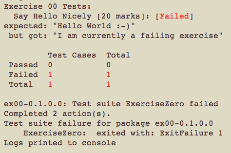

# Exercise 00

A simple end-to-end test of the CSU34016 exercise system.

## Prerequisite

Haskell `stack` is installed on the machine you are using.

## Task

1. Open a command-line window and navigate to CSU34016-1920/Exercise00
2. Enter `stack test`. 
3. If this is your first time running `stack` in one of the CSU34016 Exercise folders, you may have to wait while `stack` ensures it has access to the correct versions of both the Haskell compiler and libraries. This delay should only happen once.
4. Eventually `stack` will compile, build and test the code. A lot of logging "stuff" will scroll past, ending with something like this: 
    

   You may see some warnings involving stuff that starts with `ZERO_SLOP_`. These can safely be ignored.
5. The test fails: read the test outcome carefully. 
6. Your task is to edit `src/Ex00.hs` to:
  1. Change the first line to contain your name and TCD username
  2. Get the test to pass. 
  3. Check your changes by running `stack test` again.
7. To submit, simply upload **only** your revised `Ex00.hs` file to Blackboard. Do **not** rename the file in any way.